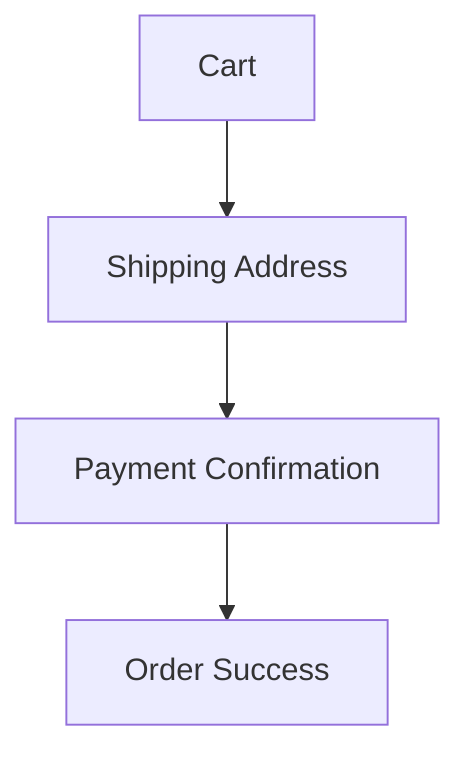

# 🌿 Ecoyaan Checkout Flow (Frontend Assignment)

A modern **eco-commerce checkout experience** inspired by sustainable marketplace platforms like [Ecoyaan](https://www.ecoyaan.com).

This project demonstrates a **complete multi-step checkout flow** built using **server-side rendering and modern frontend practices**.

---

# 🚀 Live Demo

🔗 **[Live Application](https://ecoyaan-checkoutt.vercel.app/)**

---

# 🖼️ Preview

Checkout flow:



This mimics a **real e-commerce purchase journey**.

---

# 🧰 Tech Stack

Built with modern frontend technologies:

* **[Next.js](https://nextjs.org/)** – React framework with SSR
* **[React](https://reactjs.org/)** – Component-based UI
* **[Tailwind CSS](https://tailwindcss.com/)** – Utility-first styling
* **Context API** – State management
* **Next.js API Routes** – Mock backend
* **Server Side Rendering (SSR)** – Data fetched on page load

---

# ✨ Features

✔ **Server-Side Rendering** for cart data
✔ **Clean and responsive** UI design
✔ **Multi-step** checkout flow
✔ **Shipping address form** with validation
✔ **Payment confirmation** page
✔ **Order success** screen
✔ **Mock backend** using API routes
✔ **Interactive** cart interface
✔ **Mobile-friendly** layout

---

# 📂 Project Structure

```text
ecoyaan-checkout
│
├── components
│   ├── CheckoutSteps.js
│   └── CartItem.js
│
├── pages
│   ├── index.js        (Cart Page)
│   ├── shipping.js     (Address Form)
│   ├── payment.js      (Payment Page)
│   ├── success.js      (Order Confirmation)
│   │
│   └── api
│       └── cart.js     (Mock API)
│
├── public
├── styles
└── package.json

```

---

# ⚙️ Installation

Clone the repository and install dependencies:

```bash
git clone https://github.com/srishtigupta1234/ecoyaan-checkout.git
cd ecoyaan-checkout
npm install

```

Run the development server:

```bash
npm run dev

```

Open in browser:
[http://localhost:3000](https://www.google.com/search?q=http://localhost:3000)

---

# 🌍 Deployment

The project is deployed using **[Vercel](https://vercel.com/)**, which provides seamless hosting for Next.js applications.

1. Push project to GitHub
2. Import repository into Vercel
3. Deploy instantly

---

# 🎯 Key Learning Outcomes

* Implementing **SSR with Next.js**
* Designing a **multi-page checkout experience**
* Building **reusable React components**
* Creating **mock APIs with Next.js**
* Developing **responsive UI using Tailwind**

---

# 👩‍💻 Author

**Srishti Gupta**
*Frontend Developer | Full Stack Developer*

* **GitHub:** [srishtigupta1234](https://github.com/srishtigupta1234)
* **LinkedIn:** [srishtigupta1](https://www.linkedin.com/in/srishtigupta1/)

---
